# Задание №1
3 раза получаю все данные из таблиц 

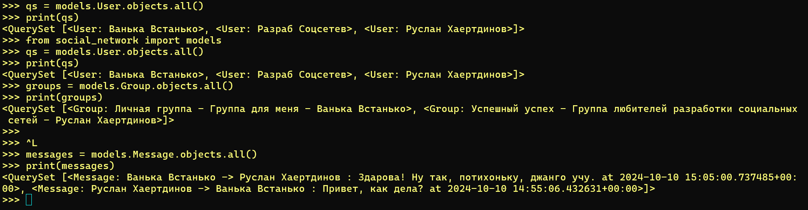

Починил встроенную python console

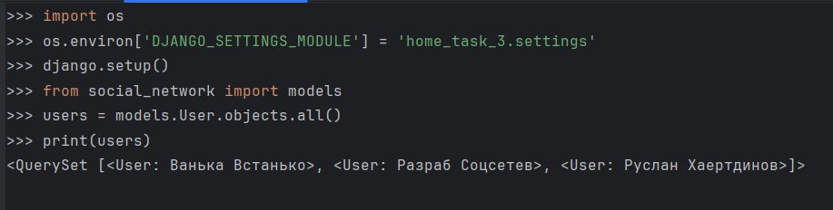

Добавляю 2 пользователей в таблицу пользователей, убеждаюсь в том, что запрос к БД совершается только при создании объекта 

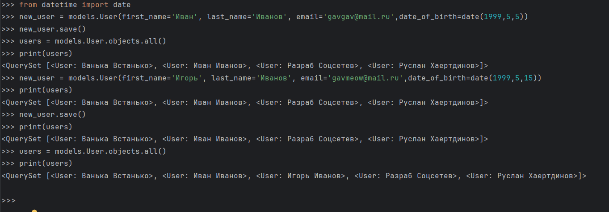

Создаю сообщение в таблице сообщений

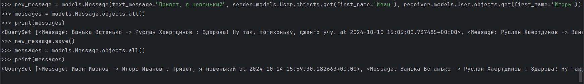

# Задание №2
Изучаю filter(), узнал про "наивную" и "осведомленную" дату

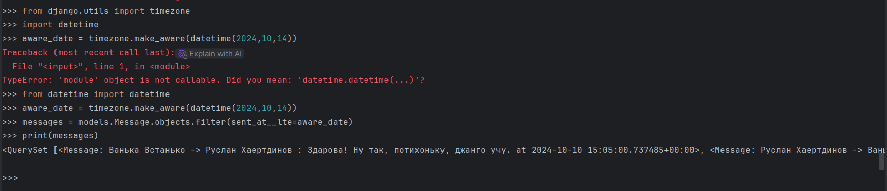
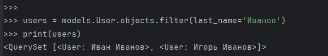
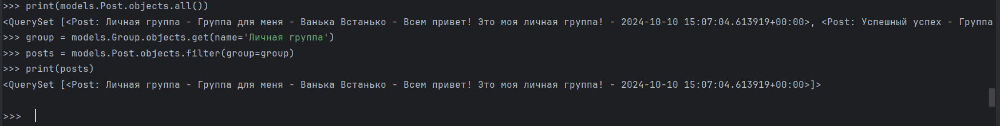

Изучаю exclude()

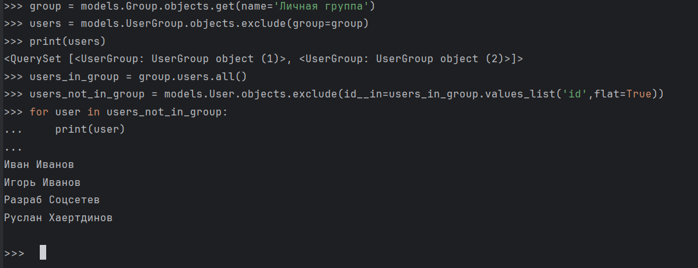
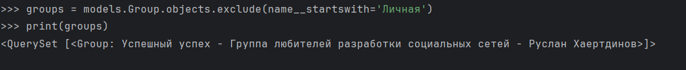

А здесь order_by()

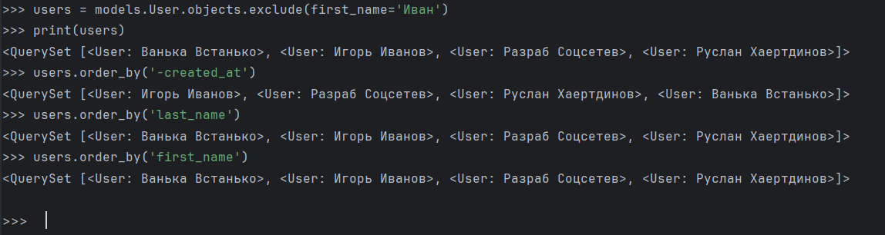

# Задание №3
Использую связь

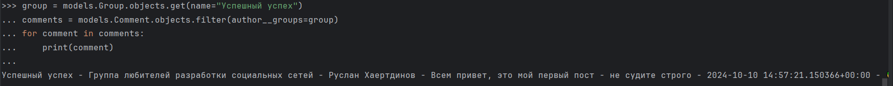
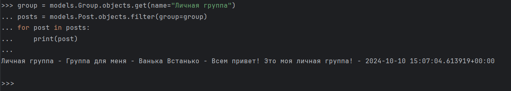

Использую value

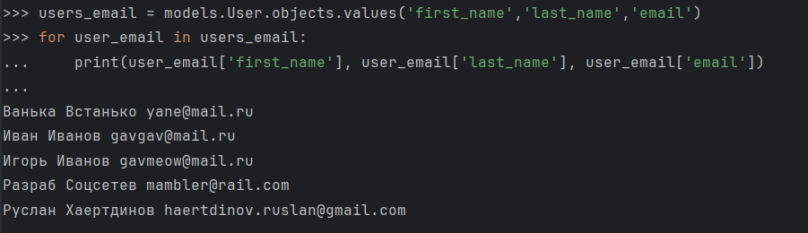
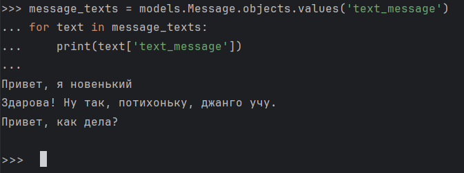
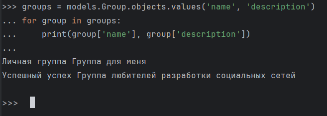

Использую value_list

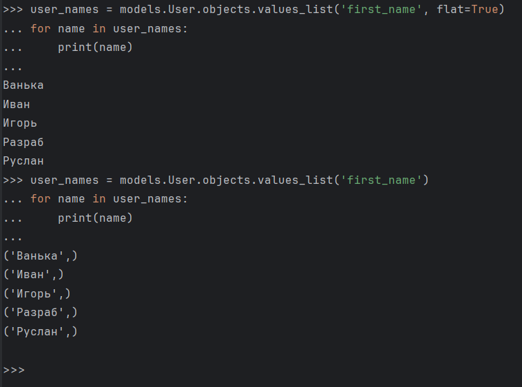
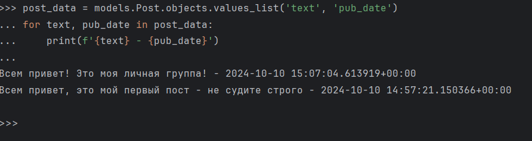
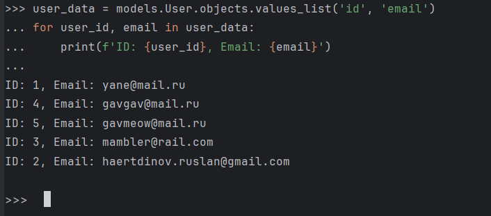

# Задание №4
*AND*

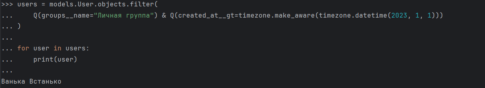
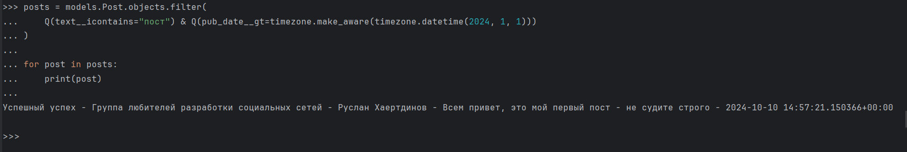
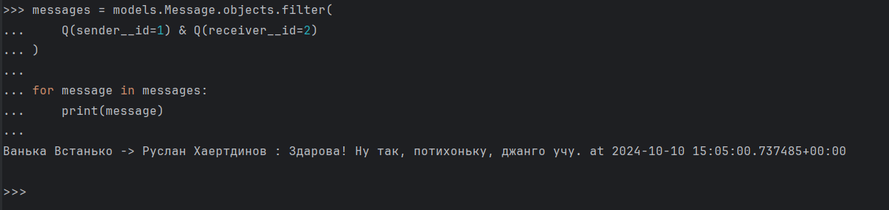

*OR*

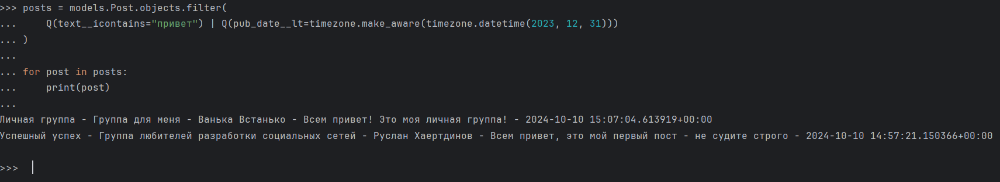
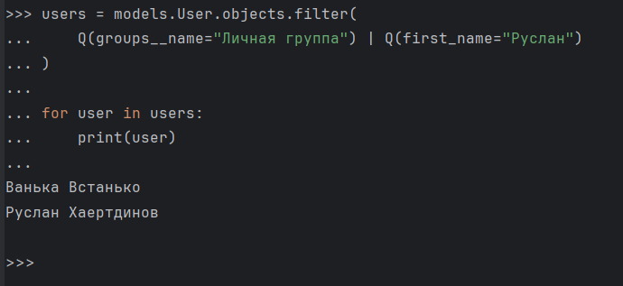
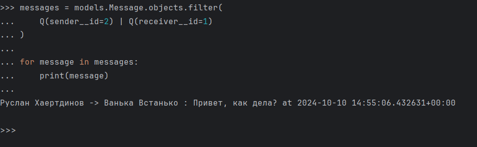

*~*

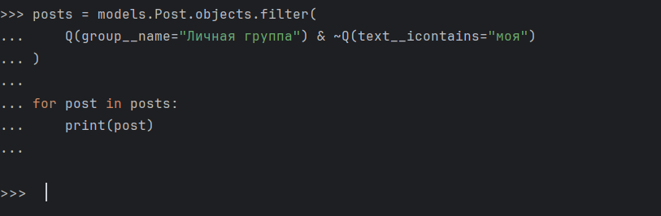
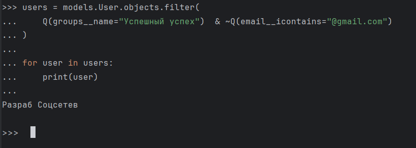
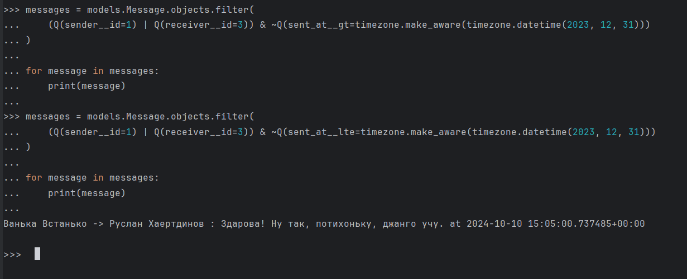

# Задание №5
annotate()

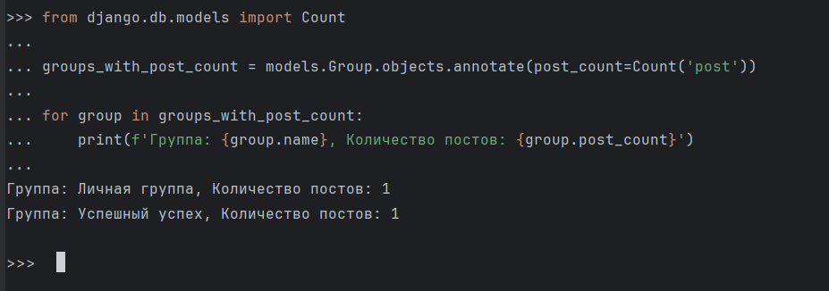
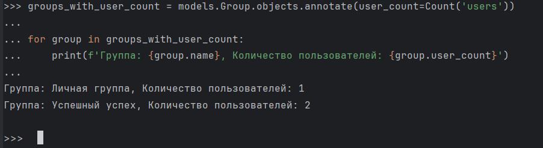
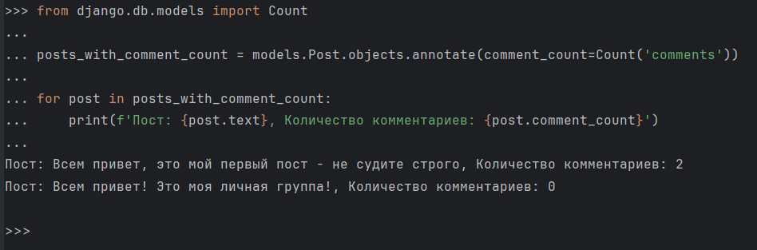

aggregate()

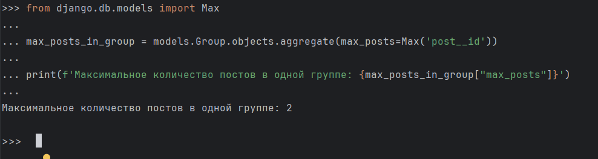
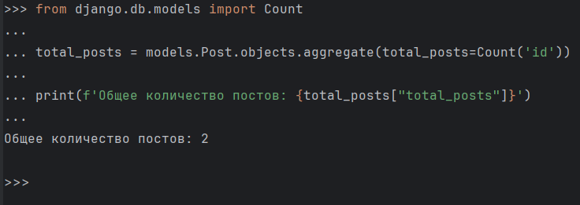
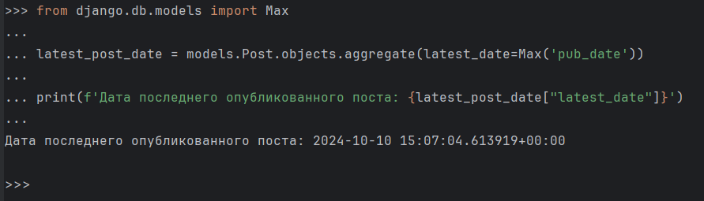
